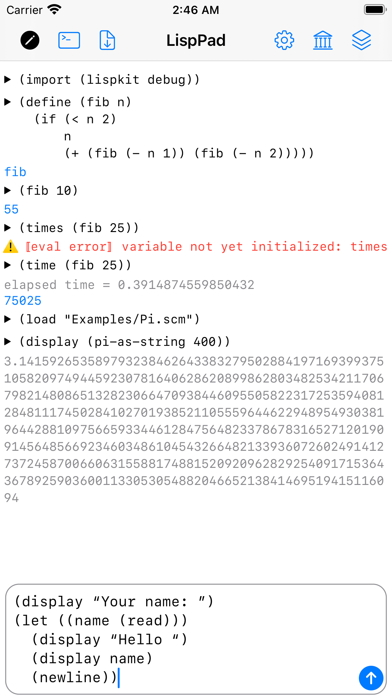
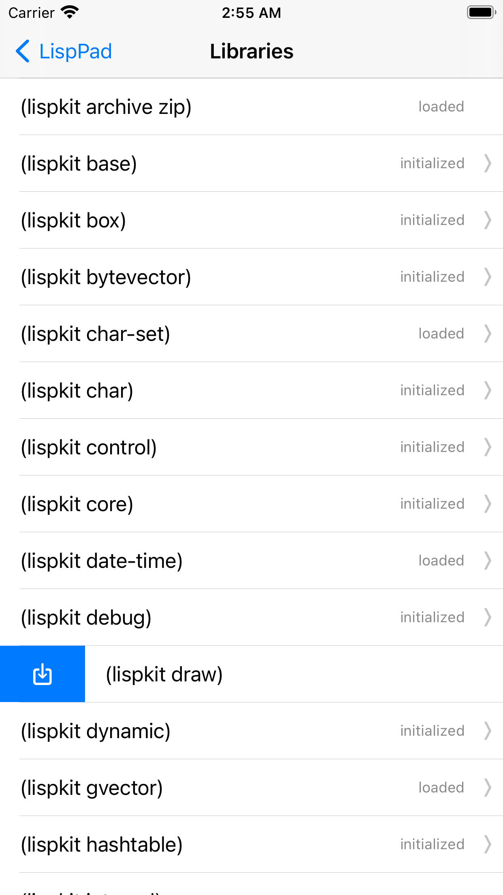
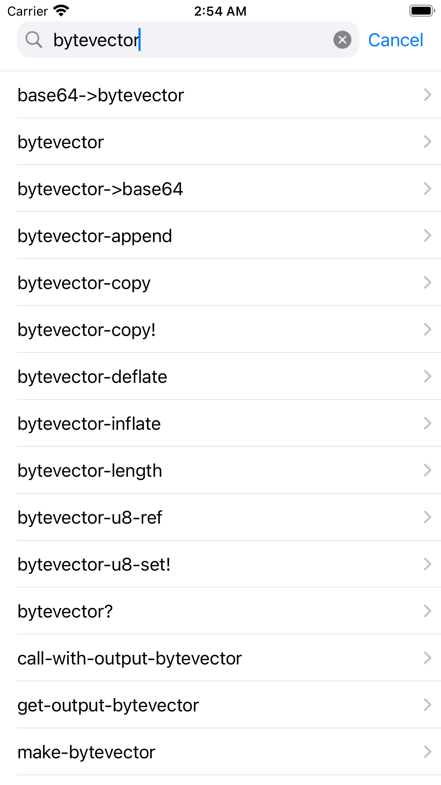
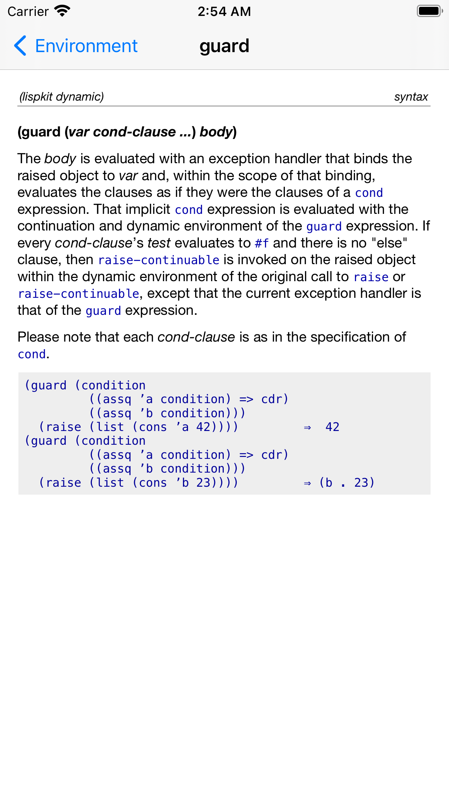
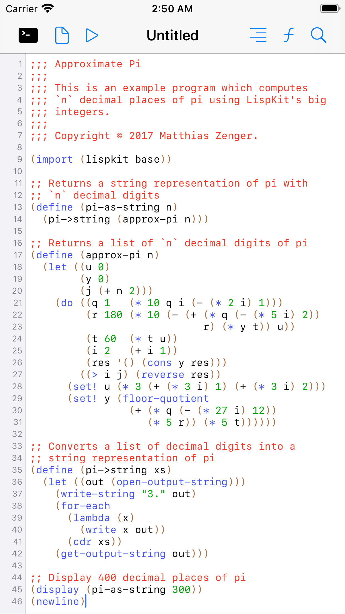
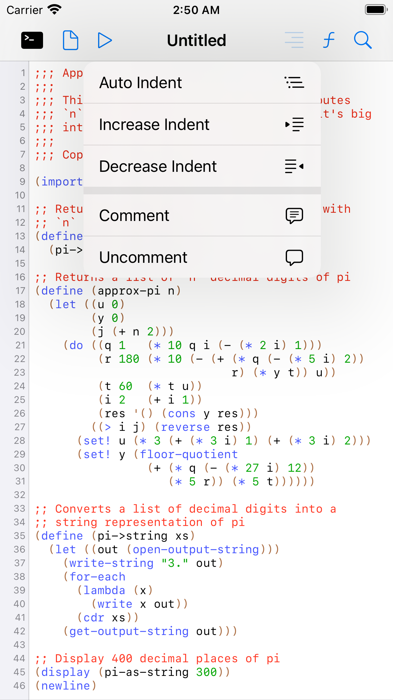
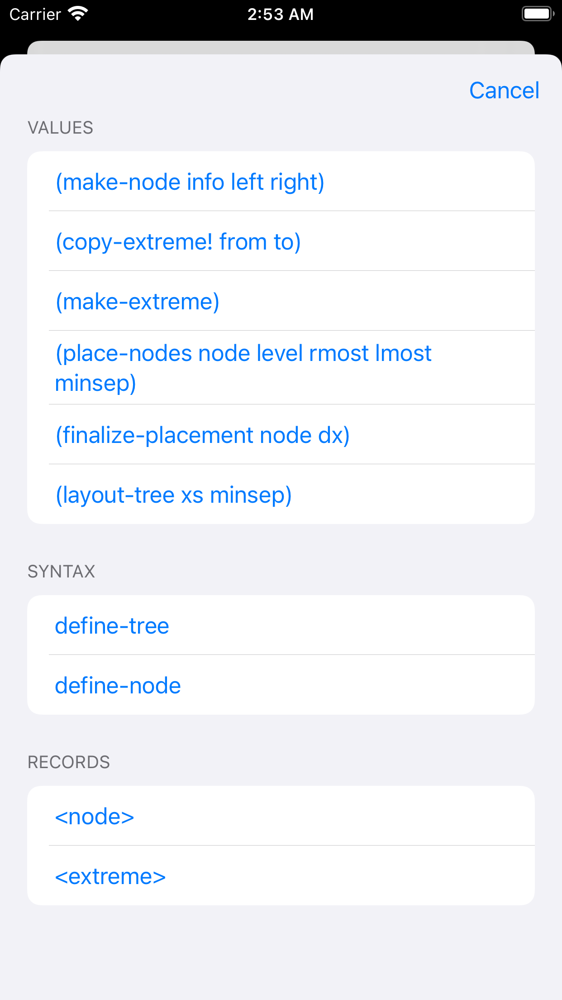
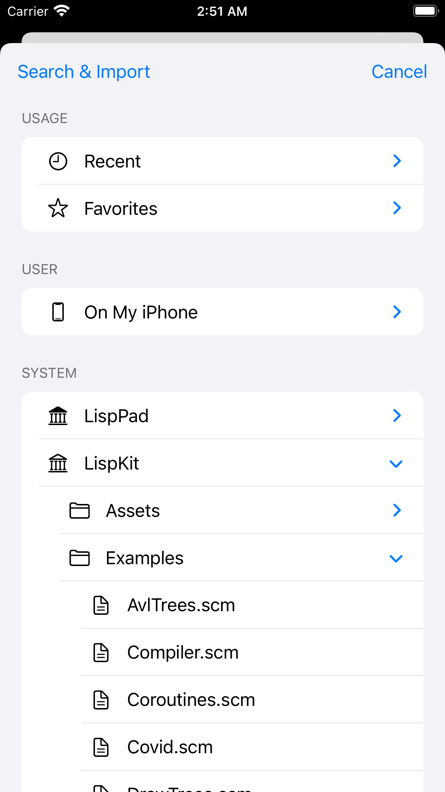
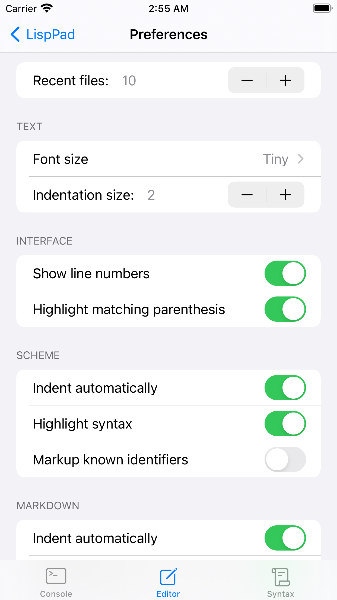

&nbsp;&nbsp; LispPad Go
========================

## Overview

_LispPad Go_ is a simplified version of the [macOS application _LispPad_](http://www.lisppad.app) for iPhones and iPads. _LispPad_ is based on the [_LispKit_ framework](http://github.com/objecthub/swift-lispkit) which features a R7RS-compliant implementation of Scheme. The [change log](CHANGELOG.md) provides an overview of the releases.

## Application overview

### Console

### Editor

### File organizer

### Preferences

## Included assets

### Fonts

- [Iosevka](https://github.com/be5invis/Iosevka), © 2015-2022 Renzhi Li \([SIL Open Font License 1.1](https://scripts.sil.org/cms/scripts/page.php?site_id=nrsi&id=OFL)\)
- [Inconsolata](https://www.levien.com/type/myfonts/inconsolata.html), © 2006 The Inconsolata Project Authors \([SIL Open Font License 1.1](https://scripts.sil.org/cms/scripts/page.php?site_id=nrsi&id=OFL)\)
- [Fira Code](https://github.com/tonsky/FiraCode), © 2014-2020 The Fira Code Project Authors \([SIL Open Font License 1.1](https://scripts.sil.org/cms/scripts/page.php?site_id=nrsi&id=OFL)\)
- Source Code Pro, © 2010, 2012 [Adobe Systems Inc.](http://www.adobe.com/) \([SIL Open Font License 1.1](https://scripts.sil.org/cms/scripts/page.php?site_id=nrsi&id=OFL)\)
- Roboto Mono, © Christian Robertson \(Apache License 2.0\)

### Audio samples

- <https://www.bensound.com/royalty-free-music>

## Requirements

- [Xcode 13](https://developer.apple.com/xcode/)
- [Swift 5.5](https://developer.apple.com/swift/)
- [Carthage](https://github.com/Carthage/Carthage)
- [LispKit](http://github.com/objecthub/swift-lispkit)
